<!-- START doctoc generated TOC please keep comment here to allow auto update -->
<!-- DON'T EDIT THIS SECTION, INSTEAD RE-RUN doctoc TO UPDATE -->
**Table of Contents**  *generated with [DocToc](https://github.com/thlorenz/doctoc)*

- [Development Guide](#development-guide)
  - [Build a Github App](#build-a-github-app)
  - [Deploy to ibm cloud code engine](#deploy-to-ibm-cloud-code-engine)
  - [Run the test](#run-the-test)

<!-- END doctoc generated TOC please keep comment here to allow auto update -->

# Development Guide

Overall you can follow [this guide](https://pr-agent-docs.codium.ai/installation/github/) to build a `Github App`, and then deploy the `Github App` into IBM Cloud as a `code engine application`, where code engine is the IBM Cloud Serverless platform.

## Build a Github App

Basically you can follow [this guide](https://docs.github.com/en/apps/creating-github-apps/registering-a-github-app/registering-a-github-app) to register a GitHub App under your personal account or under any organization you own.

In this doc, we will take registering a Github App under your personal account as an example. You can just follow exatly `step 1` to `step 22` in [this guide](https://docs.github.com/en/apps/creating-github-apps/registering-a-github-app/registering-a-github-app). 

(1). Screenshots for the setup of a Github App

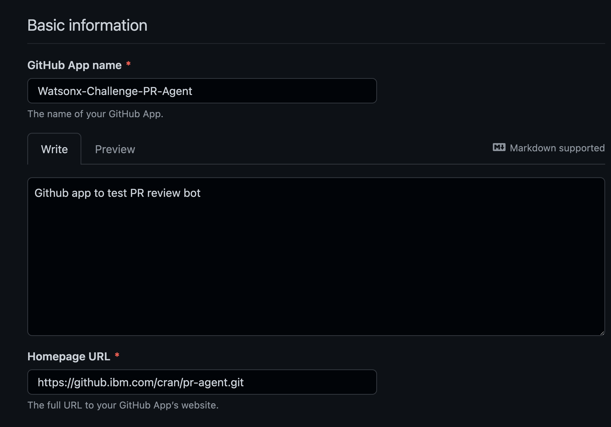

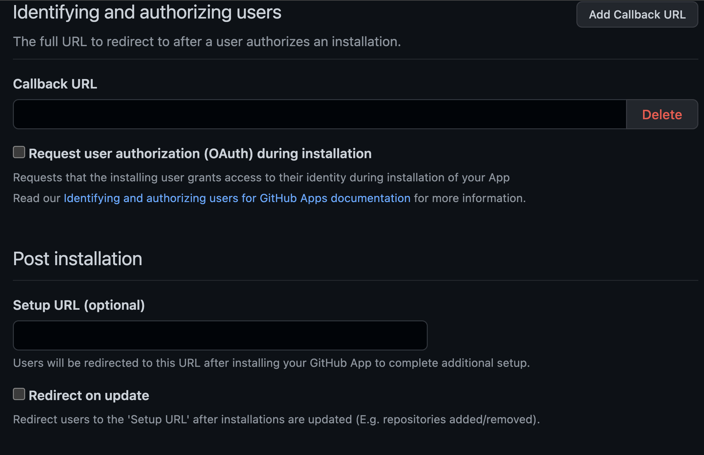

Notice that for `webhook`, in this example it's `https://chuan-pr-agent.15pitsrto23o.us-south.codeengine.appdomain.cloud/api/v1/github_webhooks`, where `https://chuan-pr-agent.15pitsrto23o.us-south.codeengine.appdomain.cloud` is the url of `Code Engine Application` which is obtained from IBM Cloud Code Engine console (your url should be different, and this will be explained in the later section), and `api/v1/github_webhooks` is a fixed endpoint that is handling github repo related events (new PR, new commits, comments, etc.).

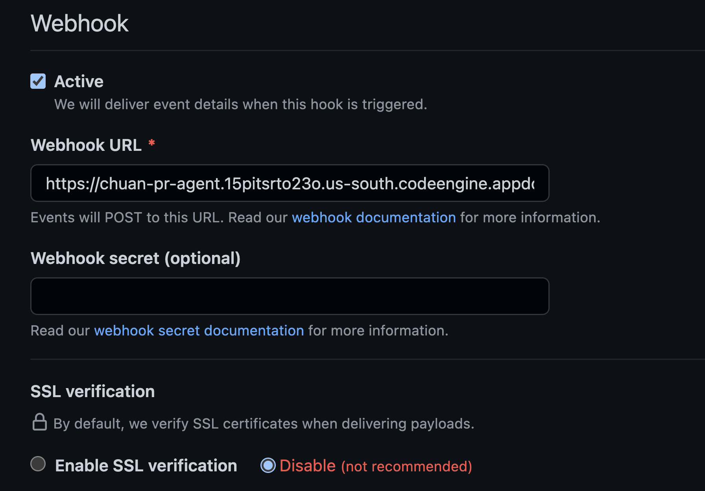

Need to create a private key to sign access token requests. You need to save the private key pem file in your local, and it would be needed later when setup Code Engine environment variable for the Github App.

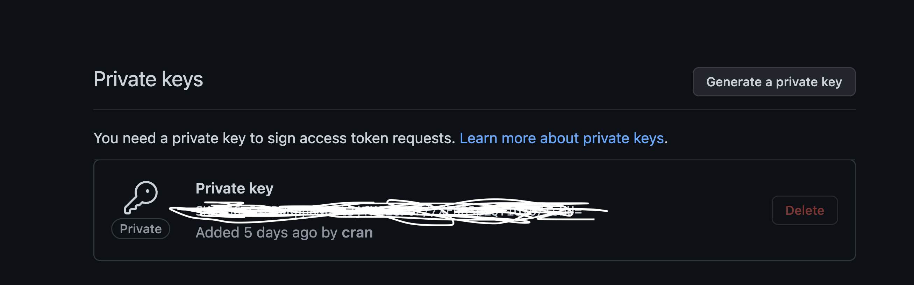

Set these permissions in `Repository permissions` section:
- Pull requests: Read & write
- Issue comment: Read & write
- Metadata: Read-only
- Contents: Read-only

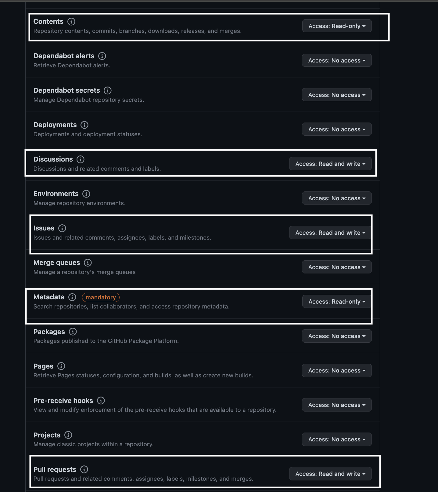

Mainly set the following events in `Subscribe to events` section:
- Issue comment
- Pull request
- Push (if you need to enable triggering on PR update)

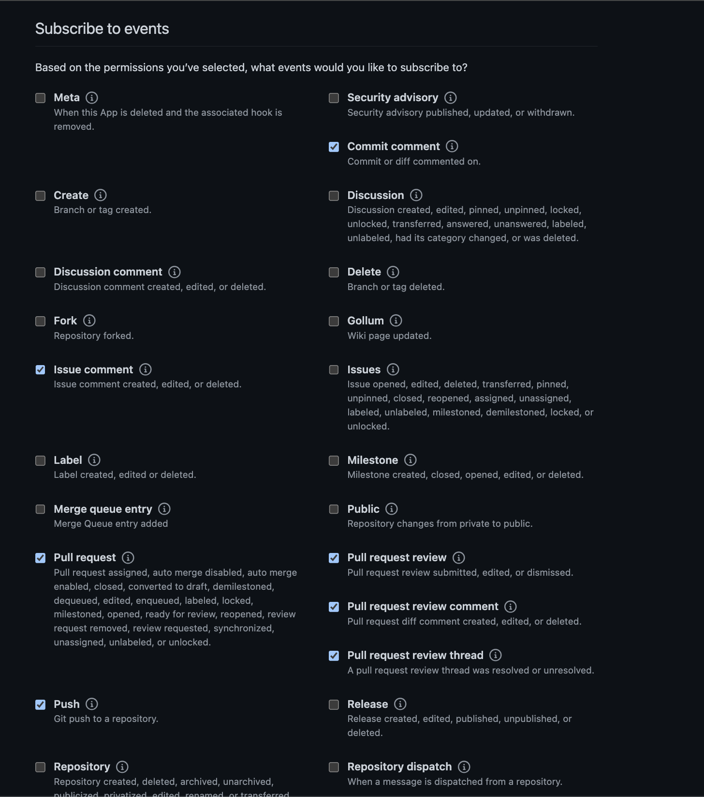

if you allow your GitHub App to be installed by any user or organization, choose `Any account` in below:

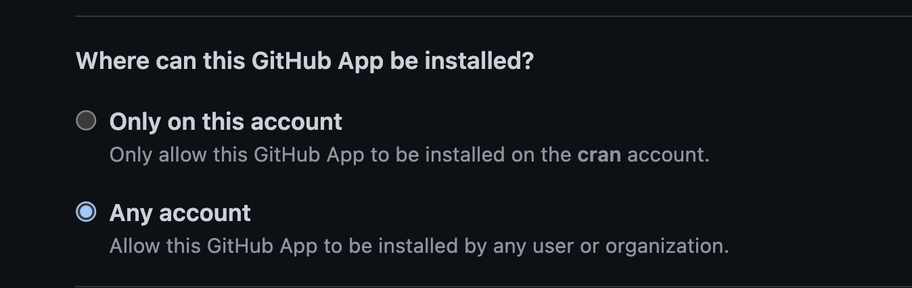

After you input all above info, click `Create Github App` button to finish the creation of the github app.

You can tet the APP ID of the github app by visiting [this link](https://github.ibm.com/settings/apps), then click `Edit` button for the github app, and then you can get the github app id in section `App ID` as below shows. Save the app id as it would be used in the code engine application environment variable.

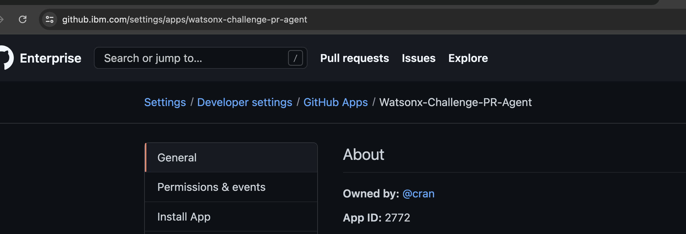


## Deploy to ibm cloud code engine

[IBM Cloud Code Engine](https://cloud.ibm.com/codeengine/overview) is an ibm cloud hosted service to run your container, application, function or job on a managed serverless platform. The main guide we follow to deploy the `pr-agent` application through IBM Cloud Code Engine (CE) is located [here](https://cloud.ibm.com/docs/codeengine?topic=codeengine-app-source-code). Detailed steps as below show:

(1). Setup the CE CLI

Follow [this link](https://cloud.ibm.com/docs/codeengine?topic=codeengine-install-cli) to setup the Code Engine CLI. The CLI is very useful for managing the lifecycle of the Code Engine Application and related assets (e.g. secretes, etc.),  debugging the application issues, etc.

(2). Create a CE project

Follow [this doc](https://cloud.ibm.com/docs/codeengine?topic=codeengine-manage-project) to create a project where your CE application runs under.

(3). Deploy your application

Mainly follow [this doc](https://cloud.ibm.com/docs/codeengine?topic=codeengine-app-source-code) to deploy your application through CE, notice it's preferred to deploy from repository source code. If you want to deploy from images, you could refer to [this link](https://cloud.ibm.com/docs/codeengine?topic=codeengine-deploy-app-crimage)


Basically after you create the `project`, you can deploy your app under the project. You can do it via UI or from CLI. Here we focus on UI. go to [project page](https://cloud.ibm.com/codeengine/projects), click your project, click `Applications` tab in the left, and then click `Create`, in the next pages, there are mainly several things need to pay attention to:

a. In the `Code` section, ensure choosing `Build container image from source code`, and then you need to specify the code repository URL (e.g. `git@github.ibm.com:gyliu/pr-agent.git`); 

b. Need to create `SSH Secret` for accessing the code repository, and add it into the `Code` section's build details. Basically you can follow [this page](https://docs.github.com/en/enterprise-server@3.8/authentication/connecting-to-github-with-ssh/generating-a-new-ssh-key-and-adding-it-to-the-ssh-agent) to generate a new ssh public/private key pair, notice that when tips you `Enter passphrase`, you can just click `Enter` without inputing any password (Code Engine seems cannot handle well with passphrase case), then you need to add the public key (e.g. `id_ed25519.pub`) into the `Deploy keys` (go to the repo, click `Settings` -> `Deploy keys`) of the github repository you want to access. As below shows:

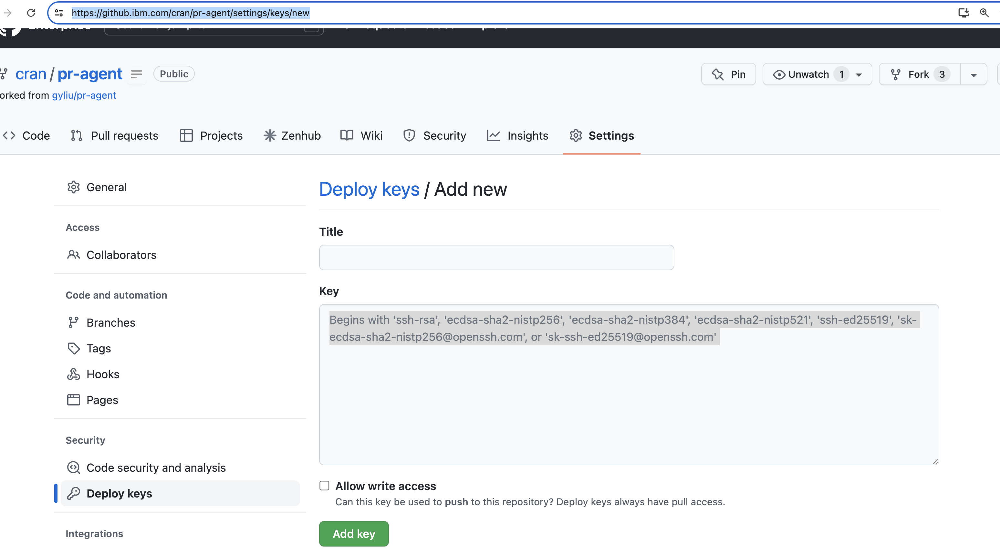

Then you need to follow [this doc](https://cloud.ibm.com/docs/codeengine?topic=codeengine-secretcm-reference#secretcm-reference-fullref-cli) to leverage CE CLI to create the secret based on the private key pem file. example command could be like below, which create a secret named as `github-app-private-key` using the private key pem file

```
 ibmcloud ce secret create -n github-app-private-key --from-file private_key=/Users/chuanran/Downloads/pr-agent-chuan-test.2024-07-10.private-key.pem
```

After that, you can choose the `SSH Secret` you just created in `Code section's build details`.

c. You need to specify `Branch name` too, either `main` or any other branch you want to deploy to ibm cloud.

d. You need to specify the path of your `Dockerfile` too. 

The below screenshots are examples for above step a, b, c and d.

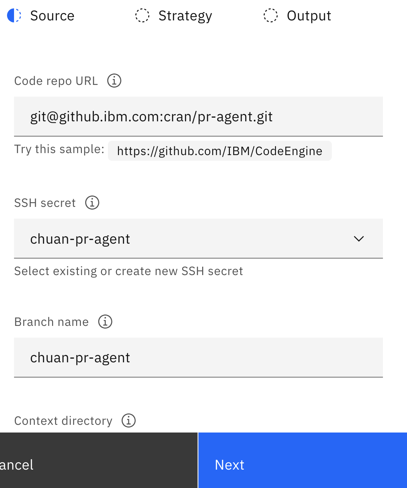

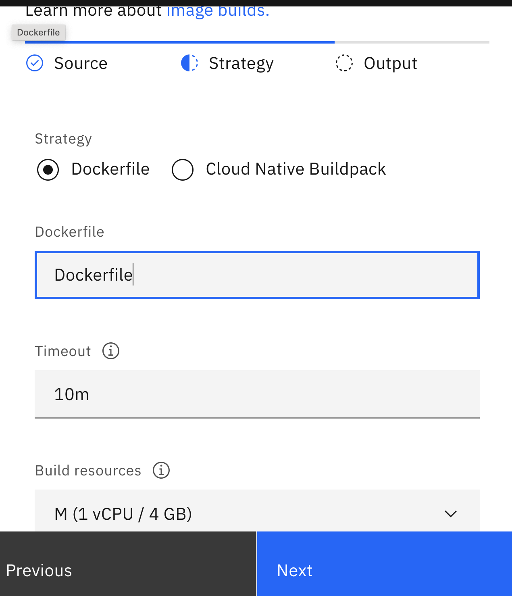

e. You need to specify build details on where your built image be stored

if you have not setup your ibm cloud container registry, you can refer to [this doc](https://cloud.ibm.com/registry/start). Following is an example of the build info about the registry you need to fill out.

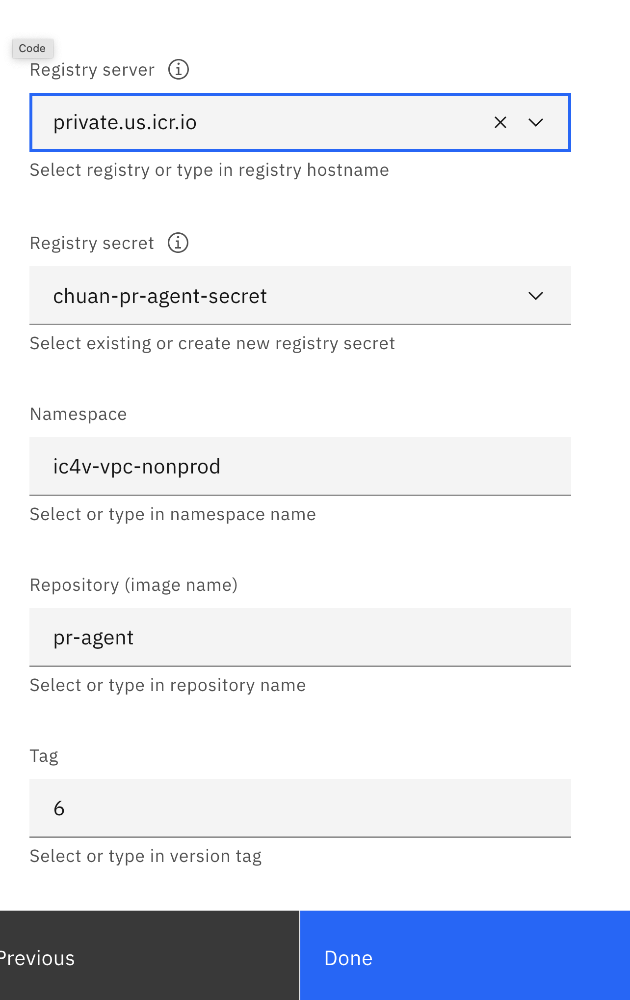

 Notice that for `Registry secret`, you need to go to `Secrets and configmaps` section, and create a `Registry secret`, following is an example about the creation:

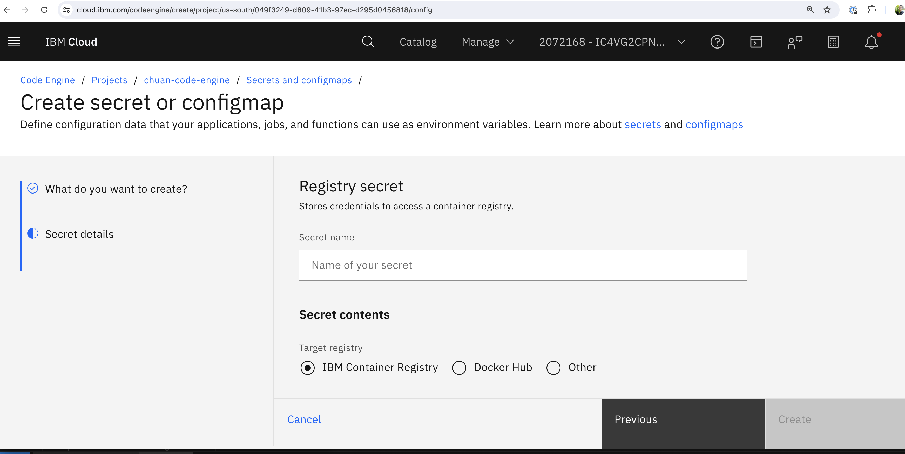

f. In `Instance resources` section, ensure `CPU and Memory` is set to at least `4 vCPU/16 GB`, if it's set to a smaller value, `pr-agent` application could crash

g. In `Environment variable` section, need to set values for below environment variables that would be consumed by `pr-agent` application

   - `user_token`: Your github token
   - `watsonx_url`: the watsonx url
   - `temperature`: watsonx temperature parameter
   - `max_new_tokens`: watsonx max new tokens parameter
   - `project_id`: This is `watsonx` Project ID. You can create a project [here](https://dataplatform.cloud.ibm.com/registration/stepone?context=wx) and associate it with an active WML instance, then obtain the project ID
   - `api_key`: In ibm cloud console, go to "Manage -> Access (IAM) -> API keys -> Create" to create and obtain your api key if not created yet
   - `github_app_id`: the ID of your github app, which you created before
   - `private_key`: private ssh key to access the github repo which contains the `pr-agent` code. `SSH Secret` has already been created before, here just add reference to it
   - `github_base_url`: set to `https://github.ibm.com/api/v3`
   - `model`, `model_turbo` and `fallback_models`: set to the model you want to use for the inferencing. e.g. `watsonx/meta-llama/llama-3-70b-instruct`.
  
h. In `Image start options` section, `Listening port` should be set to `3000`, as it's the defined port `pr-agent` app is listening to.

i. After above settings, click `Create` button to create the application;

j. Get the application URL as below shows. You may use Code Engine CLI or logging tool to debug if there's an issue causing your app could not be running well. 

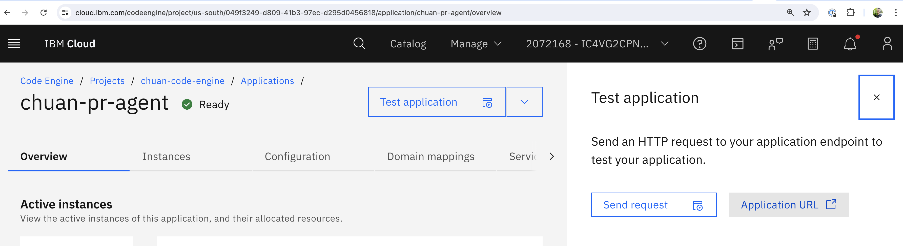

k. Go back to your `Github App` you created, and update the webhook url with the application url you just got in `step j`, appending with `api/v1/github_webhooks`

For instance if your application url is `https://chuan-pr-agent.15pitsrto23o.us-south.codeengine.appdomain.cloud/`, then you need to update the `webhook url` in github app to `https://chuan-pr-agent.15pitsrto23o.us-south.codeengine.appdomain.cloud/api/v1/github_webhooks`


## Run the test

After above `Github App` setup and depoyment of your `pr-agent` app through `Code Engine`, you can register the `Github App` to your specific github repo or even organization. Then you can create a pull request in the specific repo to test if the application/review bot can generate review comments for your PR.

(1). Register `Github App` to specific repo

Locate your Github App from [here](https://github.ibm.com/settings/apps), click `Edit`, in `Install App` section, install the github app to the specific repo or organization per your scenarios.

(2). Create a PR and run some bot commands

Once you create a PR in the repo which has the github app registered, you can see the bot can generate several git comments as following shows.

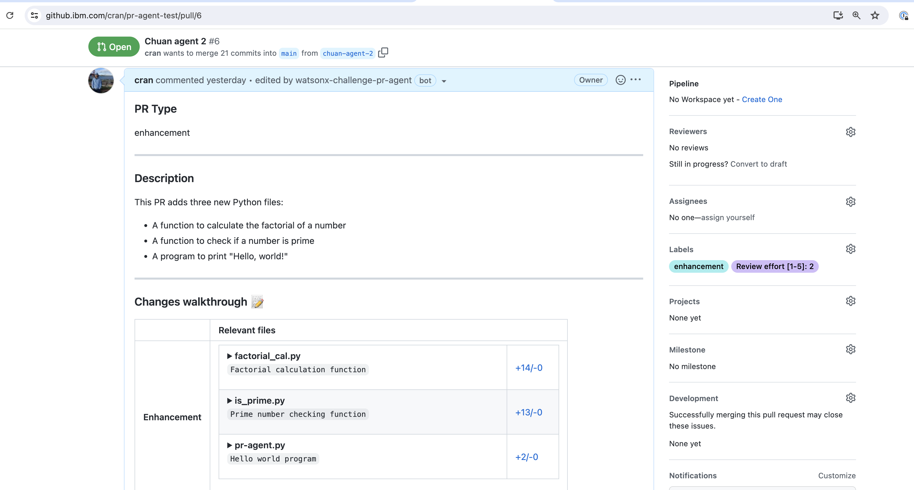

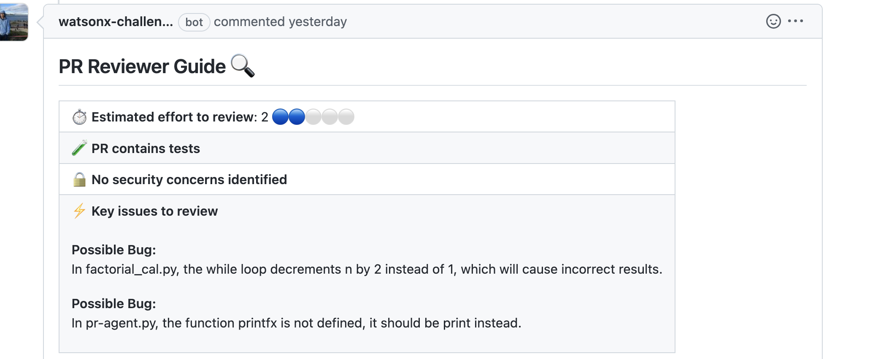


You can also run some command like `/improve` as a github issue comment, then it can generate the latest code suggestion and append it to your previous code suggestion comment. For a full list of command you can run, you can run `/help` to get the list of the commands you can run (Notice some commands are only for pro and paid users).
