# Qodo PR-Agent System Architecture Overview

**Generated:** 2025-10-07
**Project:** Qodo PR-Agent - AI-Powered Code Review Tool

## High-Level System Architecture

This diagram shows the overall system architecture of the Qodo PR-Agent, illustrating the main components and their relationships.

```mermaid
graph TB
    subgraph "External Interfaces"
        CLI[CLI Interface]
        GHA[GitHub Actions]
        Webhook[Webhook Servers]
        Browser[Browser Extension]
    end

    subgraph "Core Agent Layer"
        PRAgent[PR Agent Core]
        CommandRouter[Command Router]
    end

    subgraph "Tools Layer"
        Review[PR Reviewer]
        Describe[PR Description]
        Improve[Code Suggestions]
        Ask[PR Questions]
        LineAsk[Line Questions]
        Changelog[Update Changelog]
        AddDocs[Add Documentation]
        Labels[Generate Labels]
        HelpDocs[Help Docs]
        Similar[Similar Issues]
        Config[PR Config]
    end

    subgraph "Algorithm Layer"
        PRProcessing[PR Processing]
        PatchProcessing[Git Patch Processing]
        TokenHandler[Token Handler]
        FileFilter[File Filter]
        LangHandler[Language Handler]
    end

    subgraph "AI Handler Layer"
        BaseAI[Base AI Handler]
        LiteLLM[LiteLLM Handler]
        OpenAI[OpenAI Handler]
        Langchain[Langchain Handler]
    end

    subgraph "Git Providers"
        GitBase[Git Provider Base]
        GitHub[GitHub Provider]
        GitLab[GitLab Provider]
        Bitbucket[Bitbucket Provider]
        Azure[Azure DevOps Provider]
        Gitea[Gitea Provider]
        Gerrit[Gerrit Provider]
        CodeCommit[CodeCommit Provider]
        LocalGit[Local Git Provider]
    end

    subgraph "Infrastructure Services"
        Config[Config Loader]
        Logger[Logger]
        SecretProvider[Secret Providers]
        IdentityProvider[Identity Providers]
    end

    subgraph "External Services"
        LLMProviders[LLM Services<br/>OpenAI, Claude, etc.]
        GitServices[Git Platform APIs<br/>GitHub, GitLab, etc.]
    end

    CLI --> PRAgent
    GHA --> PRAgent
    Webhook --> PRAgent
    Browser --> PRAgent

    PRAgent --> CommandRouter
    CommandRouter --> Review
    CommandRouter --> Describe
    CommandRouter --> Improve
    CommandRouter --> Ask
    CommandRouter --> LineAsk
    CommandRouter --> Changelog
    CommandRouter --> AddDocs
    CommandRouter --> Labels
    CommandRouter --> HelpDocs
    CommandRouter --> Similar
    CommandRouter --> Config

    Review --> PRProcessing
    Describe --> PRProcessing
    Improve --> PRProcessing
    PRProcessing --> PatchProcessing
    PRProcessing --> TokenHandler
    PRProcessing --> FileFilter
    PRProcessing --> LangHandler

    Review --> BaseAI
    Describe --> BaseAI
    Improve --> BaseAI
    Ask --> BaseAI

    BaseAI --> LiteLLM
    BaseAI --> OpenAI
    BaseAI --> Langchain

    PRAgent --> GitBase
    GitBase --> GitHub
    GitBase --> GitLab
    GitBase --> Bitbucket
    GitBase --> Azure
    GitBase --> Gitea
    GitBase --> Gerrit
    GitBase --> CodeCommit
    GitBase --> LocalGit

    PRAgent --> Config
    PRAgent --> Logger
    PRAgent --> SecretProvider
    PRAgent --> IdentityProvider

    LiteLLM --> LLMProviders
    OpenAI --> LLMProviders
    Langchain --> LLMProviders

    GitHub --> GitServices
    GitLab --> GitServices
    Bitbucket --> GitServices
    Azure --> GitServices

    style PRAgent fill:#9370DB
    style CommandRouter fill:#9370DB
    style BaseAI fill:#4682B4
    style GitBase fill:#32CD32
    style Config fill:#FFD700
```

## Component Descriptions

### External Interfaces
- **CLI Interface**: Command-line tool for local execution
- **GitHub Actions**: CI/CD integration for automated PR reviews
- **Webhook Servers**: Real-time event processing from git platforms
- **Browser Extension**: Chrome extension for enhanced PR UI

### Core Agent Layer
- **PR Agent Core**: Central orchestrator managing command execution
- **Command Router**: Maps commands to appropriate tool implementations

### Tools Layer
Implements specific PR operations:
- **PR Reviewer**: Code review and feedback generation
- **PR Description**: Automatic PR description generation
- **Code Suggestions**: Improvement recommendations
- **PR Questions**: Answer questions about PRs
- **Line Questions**: Answer questions about specific code lines
- **Update Changelog**: Automatic changelog generation
- **Add Documentation**: Generate missing documentation
- **Generate Labels**: Auto-label PRs based on content
- **Help Docs**: Documentation assistance
- **Similar Issues**: Find related issues/PRs
- **PR Config**: Configuration management

### Algorithm Layer
Core algorithms for processing:
- **PR Processing**: Main PR analysis logic with token management
- **Git Patch Processing**: Diff parsing and manipulation
- **Token Handler**: Token counting and budget management
- **File Filter**: Filter files based on patterns
- **Language Handler**: Language detection and sorting

### AI Handler Layer
Abstraction for different AI providers:
- **Base AI Handler**: Common interface for all AI handlers
- **LiteLLM Handler**: Multi-provider support via LiteLLM
- **OpenAI Handler**: Direct OpenAI integration
- **Langchain Handler**: Integration with Langchain framework

### Git Providers
Platform-specific implementations for:
- GitHub, GitLab, Bitbucket, Azure DevOps, Gitea, Gerrit, AWS CodeCommit, Local Git

### Infrastructure Services
- **Config Loader**: Configuration management using Dynaconf
- **Logger**: Structured logging with Loguru
- **Secret Providers**: AWS Secrets Manager, GCP Secret Manager
- **Identity Providers**: Authentication and authorization

## Technology Stack

- **Language**: Python 3.x
- **AI/LLM**: OpenAI, Anthropic Claude, LiteLLM, Google AI
- **Git Libraries**: PyGithub, python-gitlab, GitPython, atlassian-python-api
- **Web Framework**: FastAPI, Uvicorn, Starlette
- **Configuration**: Dynaconf, PyYAML
- **Token Management**: tiktoken
- **Testing**: pytest, pytest-cov
