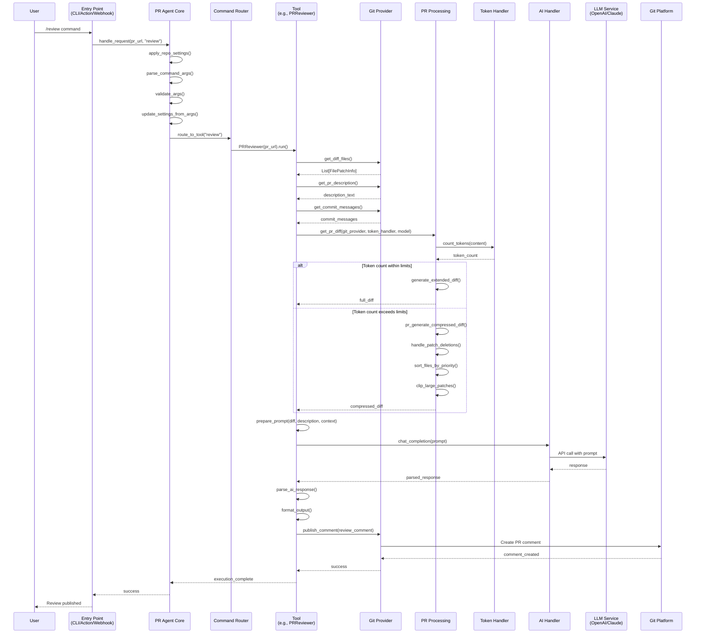
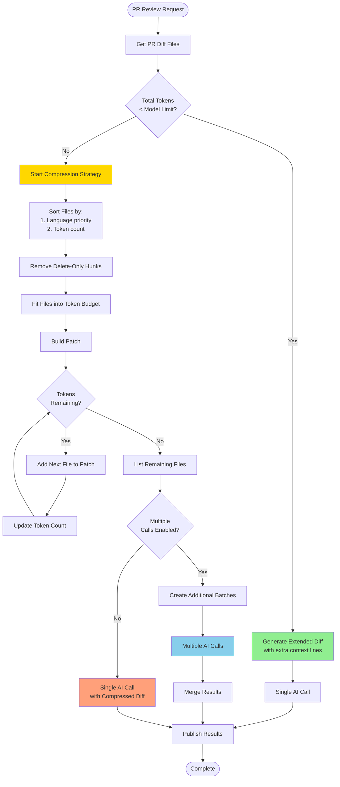
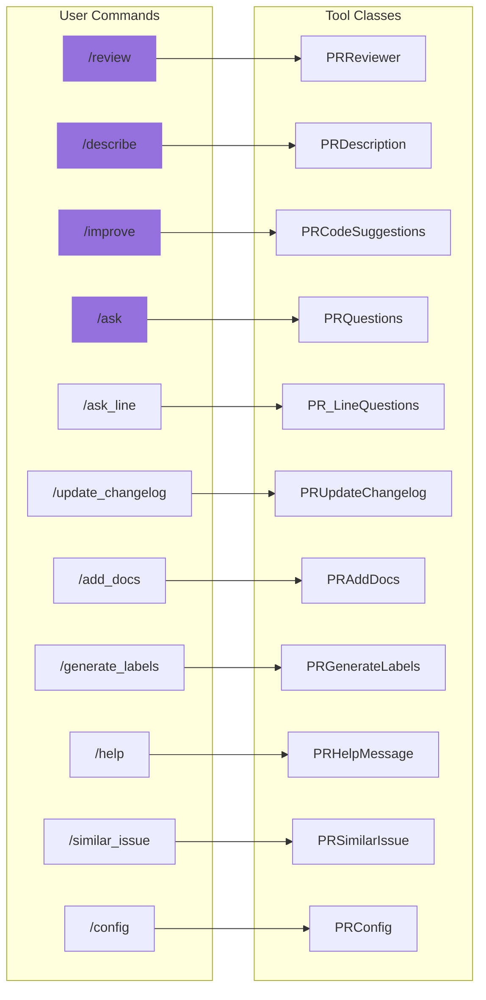
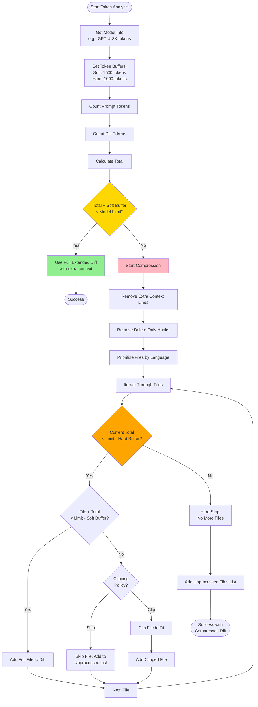

# PR-Agent Request Flow Architecture

**Generated:** 2025-10-07

## Request Processing Flow

This diagram illustrates how a PR review request flows through the system from entry point to completion.

## Request Flow for Large PRs

For PRs that exceed token limits, the system uses a compression strategy:

## Command to Tool Mapping

## Token Management Strategy

## Configuration Flow

```mermaid
flowchart LR
    Start([PR Request]) --> LoadDefaults[Load Default Config<br/>configuration.toml]
    LoadDefaults --> LoadSecrets[Load Secrets<br/>.secrets.toml]
    LoadSecrets --> CheckRepo{Repo-Specific<br/>Config Exists?}

    CheckRepo -->|Yes| LoadRepoConfig[Load from<br/>.pr_agent.toml<br/>in repo]
    CheckRepo -->|No| CheckEnv{Environment<br/>Variables?}

    LoadRepoConfig --> CheckEnv
    CheckEnv -->|Yes| ApplyEnv[Apply Environment<br/>Variables]
    CheckEnv -->|No| CheckCLI{CLI Arguments?}

    ApplyEnv --> CheckCLI
    CheckCLI -->|Yes| ApplyCLI[Apply CLI Arguments]
    CheckCLI -->|No| FinalConfig[Final Configuration]

    ApplyCLI --> FinalConfig
    FinalConfig --> Execute[Execute Command]

    style LoadDefaults fill:#E6E6FA
    style LoadRepoConfig fill:#FFD700
    style FinalConfig fill:#90EE90
```

