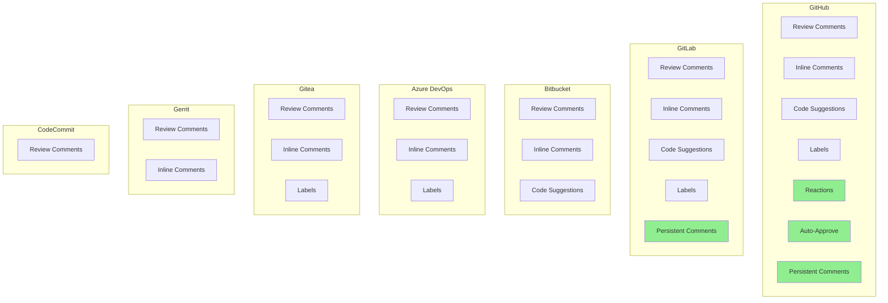
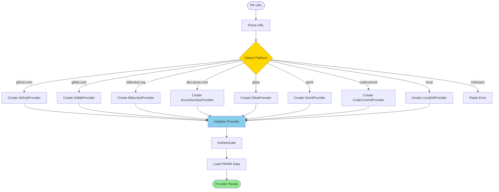
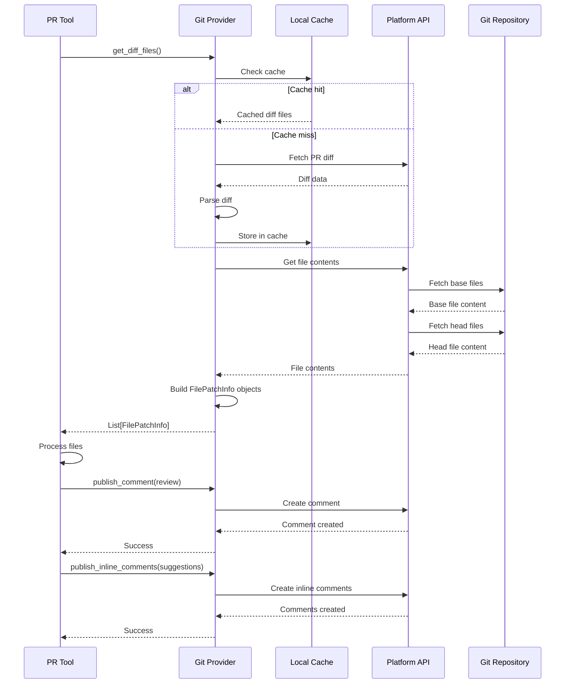
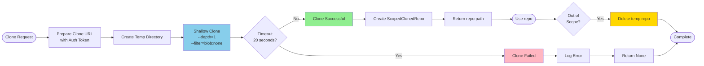
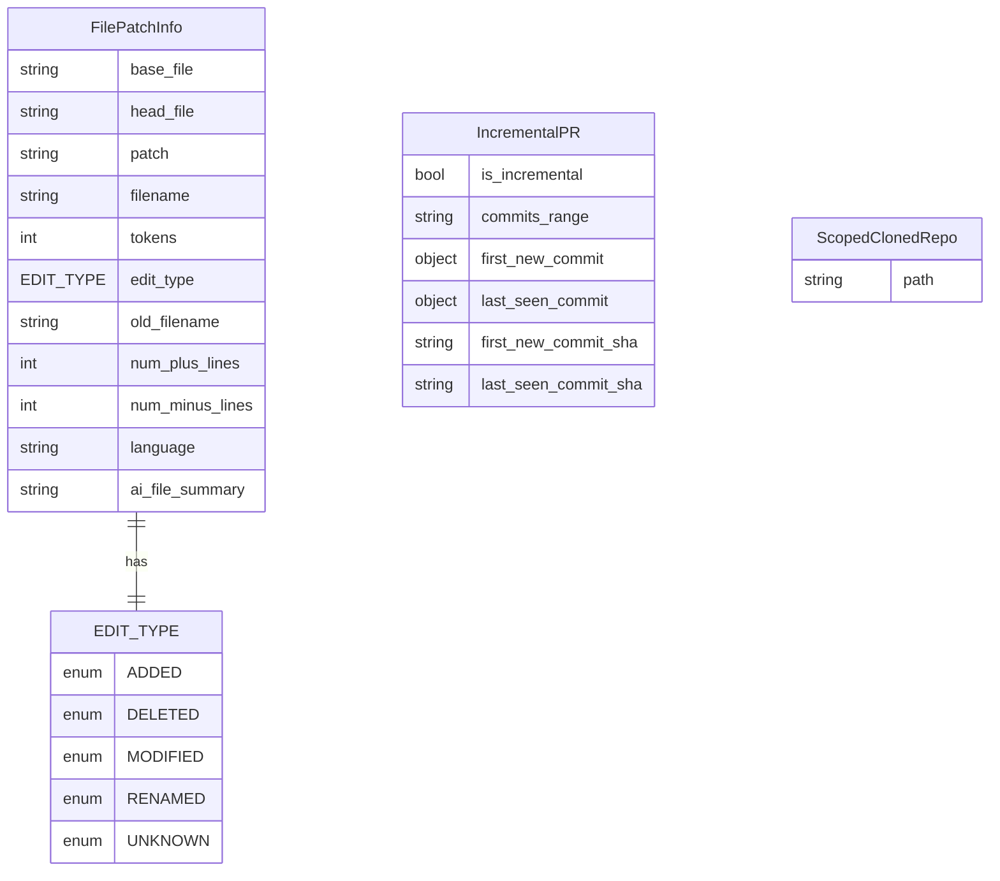

# Git Providers Architecture

**Generated:** 2025-10-07

## Git Provider Hierarchy

This diagram shows the class hierarchy and relationships between different git platform providers.

```mermaid
classDiagram
    class GitProvider {
        <<abstract>>
        +is_supported(capability) bool
        +get_diff_files() List[FilePatchInfo]
        +get_files() list
        +get_pr_description_full() str
        +get_pr_description() str
        +get_user_description() str
        +publish_description(title, body)
        +publish_code_suggestions(suggestions) bool
        +publish_comment(comment, temporary)
        +publish_inline_comment(body, file, line)
        +publish_inline_comments(comments)
        +get_issue_comments()
        +edit_comment(comment, body)
        +remove_comment(comment)
        +publish_labels(labels)
        +get_pr_labels() list
        +get_commit_messages() list
        +get_languages() dict
        +get_pr_branch() str
        +get_user_id() str
        +get_repo_settings() dict
        +clone(repo_url, dest) ScopedClonedRepo
        +get_git_repo_url(url) str
        +get_canonical_url_parts(repo, branch) Tuple
    }

    class GithubProvider {
        -github_client
        -repo
        -pr
        +is_supported(capability) bool
        +get_diff_files() List[FilePatchInfo]
        +publish_description(title, body)
        +publish_code_suggestions(suggestions) bool
        +publish_persistent_comment_full()
        +publish_inline_comments(comments)
        +create_inline_comment()
        +get_issue_comments()
        +publish_labels(labels)
        +remove_reaction()
        +add_eyes_reaction()
        +auto_approve() bool
        -_prepare_clone_url_with_token()
    }

    class GitlabProvider {
        -gitlab_client
        -project
        -mr
        +is_supported(capability) bool
        +get_diff_files() List[FilePatchInfo]
        +publish_description(title, body)
        +publish_code_suggestions(suggestions) bool
        +publish_inline_comments(comments)
        +get_issue_comments()
        +publish_labels(labels)
        -_prepare_clone_url_with_token()
    }

    class BitbucketProvider {
        -bitbucket_client
        -workspace
        -repo
        -pr
        +is_supported(capability) bool
        +get_diff_files() List[FilePatchInfo]
        +publish_description(title, body)
        +publish_code_suggestions(suggestions) bool
        +publish_inline_comments(comments)
        +get_issue_comments()
        -_prepare_clone_url_with_token()
    }

    class BitbucketServerProvider {
        -bitbucket_client
        -project
        -repo
        -pr
        +is_supported(capability) bool
        +get_diff_files() List[FilePatchInfo]
        +publish_description(title, body)
        +publish_inline_comments(comments)
        -_prepare_clone_url_with_token()
    }

    class AzureDevOpsProvider {
        -azure_client
        -project
        -repo
        -pr_id
        +is_supported(capability) bool
        +get_diff_files() List[FilePatchInfo]
        +publish_description(title, body)
        +publish_comment(comment)
        +get_issue_comments()
        +publish_labels(labels)
        -_prepare_clone_url_with_token()
    }

    class GiteaProvider {
        -gitea_client
        -repo
        -pr
        +is_supported(capability) bool
        +get_diff_files() List[FilePatchInfo]
        +publish_description(title, body)
        +publish_comment(comment)
        +get_issue_comments()
        +publish_labels(labels)
        -_prepare_clone_url_with_token()
    }

    class GerritProvider {
        -gerrit_client
        -change
        +is_supported(capability) bool
        +get_diff_files() List[FilePatchInfo]
        +publish_comment(comment)
        +publish_inline_comments(comments)
        -_prepare_clone_url_with_token()
    }

    class CodeCommitProvider {
        -codecommit_client
        -repo
        -pr_id
        +is_supported(capability) bool
        +get_diff_files() List[FilePatchInfo]
        +publish_comment(comment)
        +get_issue_comments()
        -_prepare_clone_url_with_token()
    }

    class LocalGitProvider {
        -repo_path
        -git_repo
        +is_supported(capability) bool
        +get_diff_files() List[FilePatchInfo]
        +get_commit_messages()
    }

    GitProvider <|-- GithubProvider
    GitProvider <|-- GitlabProvider
    GitProvider <|-- BitbucketProvider
    GitProvider <|-- BitbucketServerProvider
    GitProvider <|-- AzureDevOpsProvider
    GitProvider <|-- GiteaProvider
    GitProvider <|-- GerritProvider
    GitProvider <|-- CodeCommitProvider
    GitProvider <|-- LocalGitProvider

    class FilePatchInfo {
        +base_file str
        +head_file str
        +patch str
        +filename str
        +tokens int
        +edit_type EDIT_TYPE
        +old_filename str
        +num_plus_lines int
        +num_minus_lines int
        +language str
        +ai_file_summary str
    }

    GitProvider ..> FilePatchInfo : returns
```

## Platform Feature Support Matrix

## Git Provider Factory Pattern

## Provider Communication Flow

## Clone Operations

## Provider-Specific Data Models

