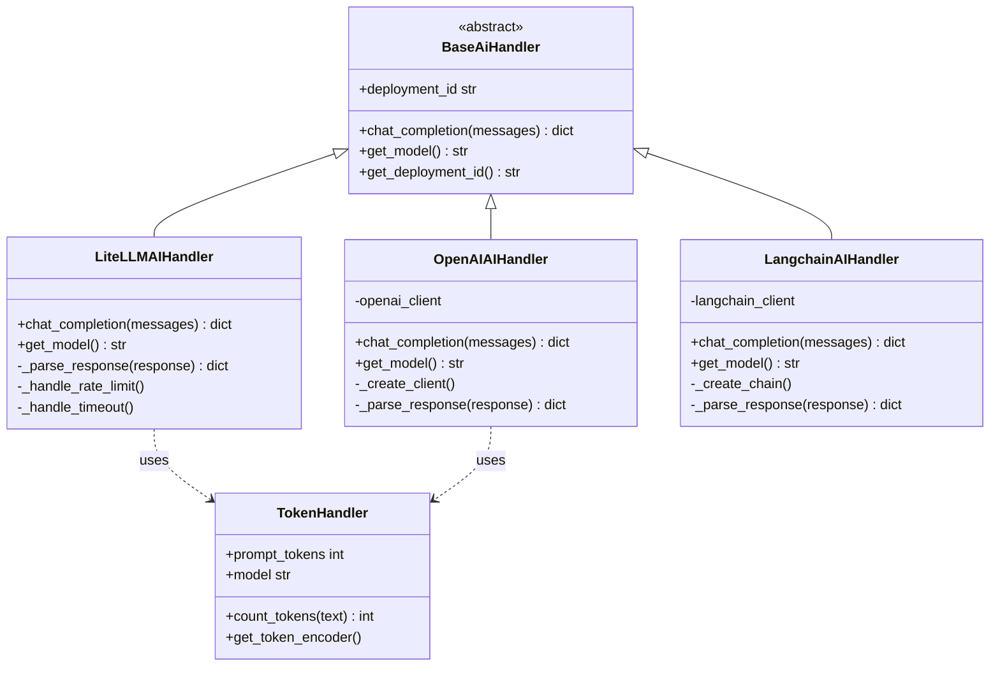
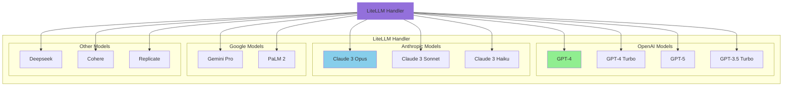
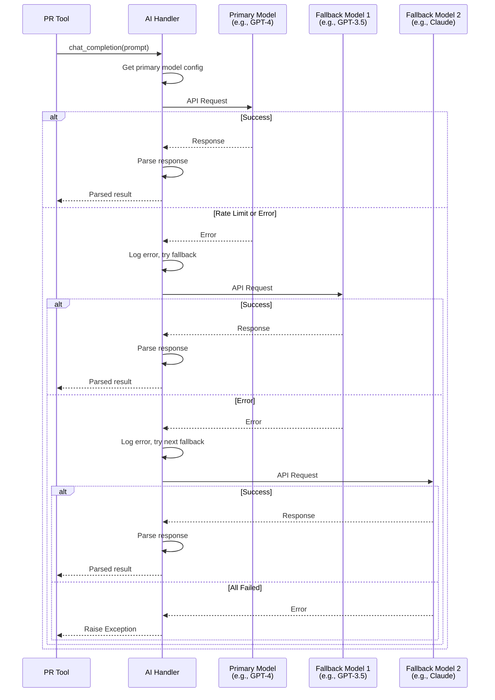
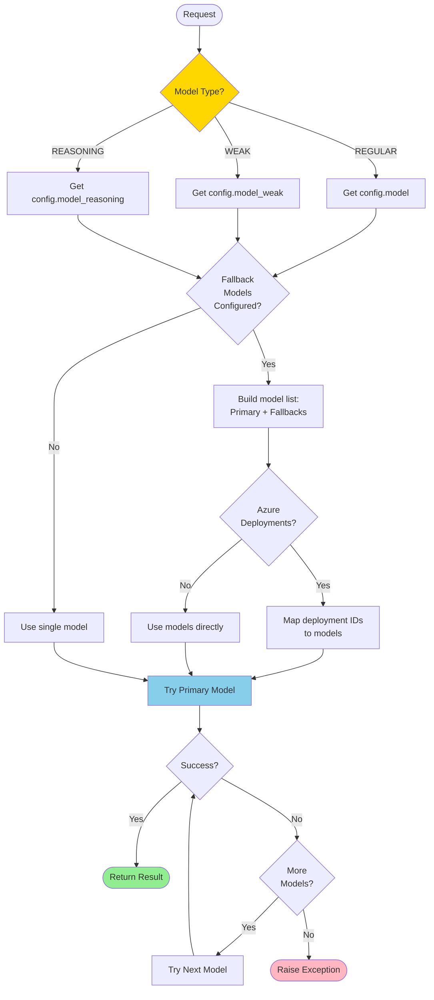
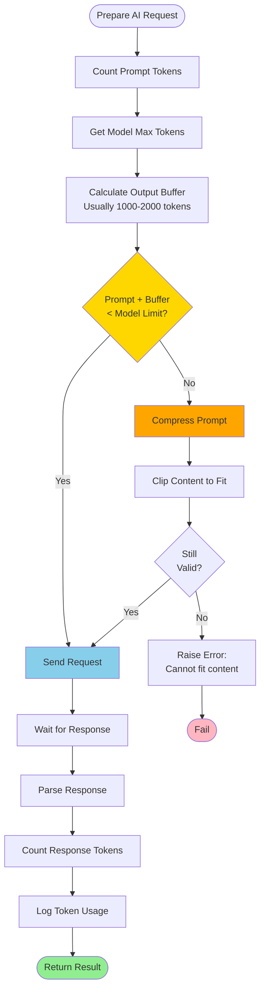
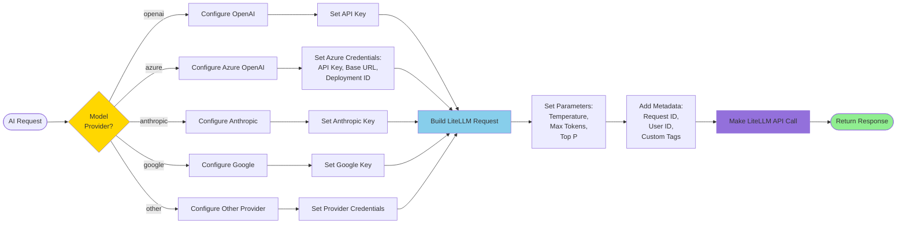
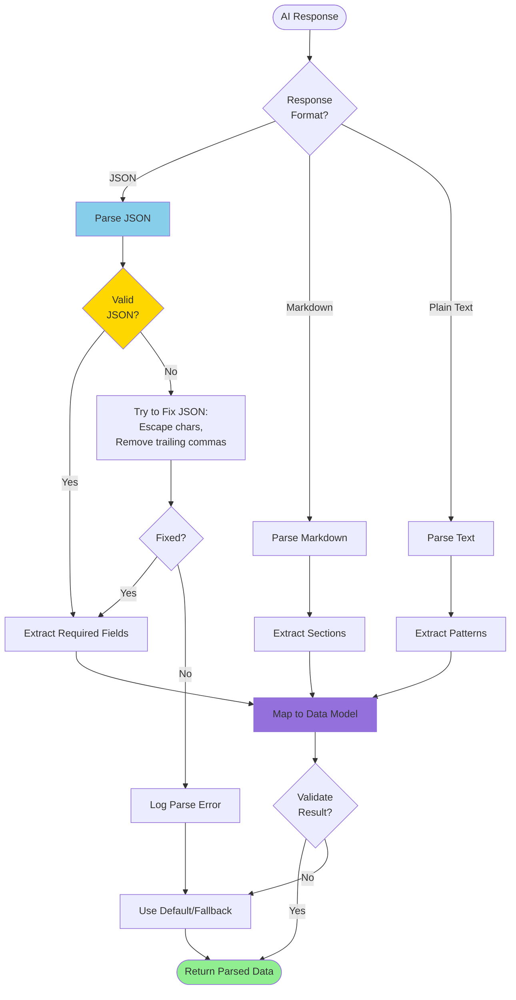
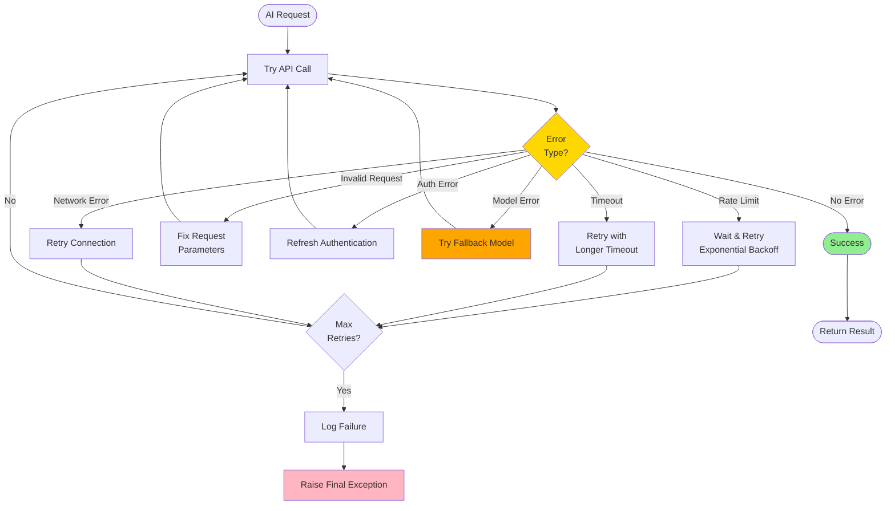

# AI Handlers Architecture

**Generated:** 2025-10-07

## AI Handler Class Hierarchy

## AI Model Support Matrix

## AI Request Flow with Fallback

## Model Selection Strategy

## Token Management in AI Calls

## LiteLLM Configuration Flow

## Response Parsing Strategy

## AI Handler Error Handling

