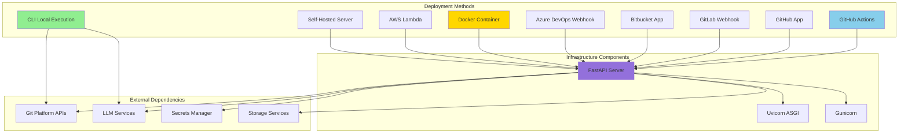
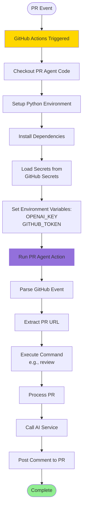
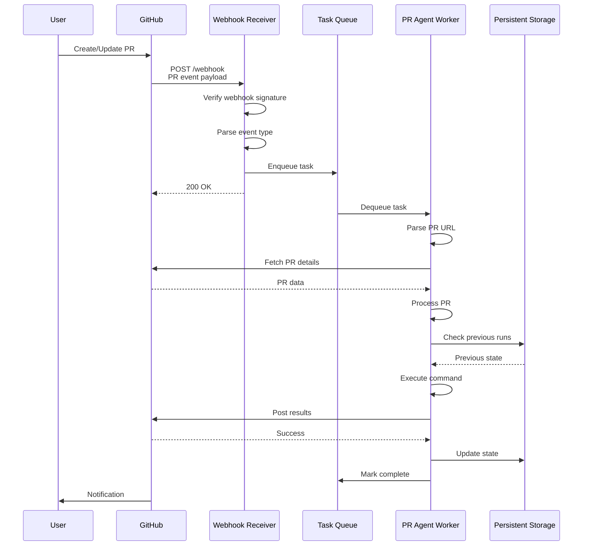
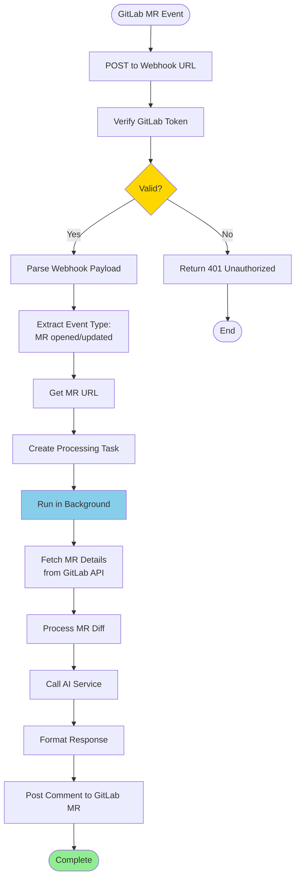
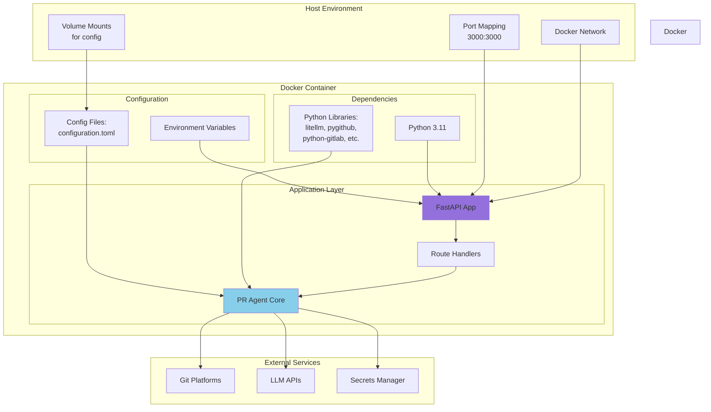
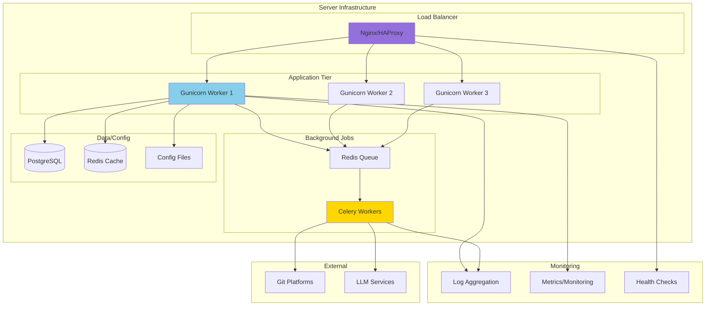
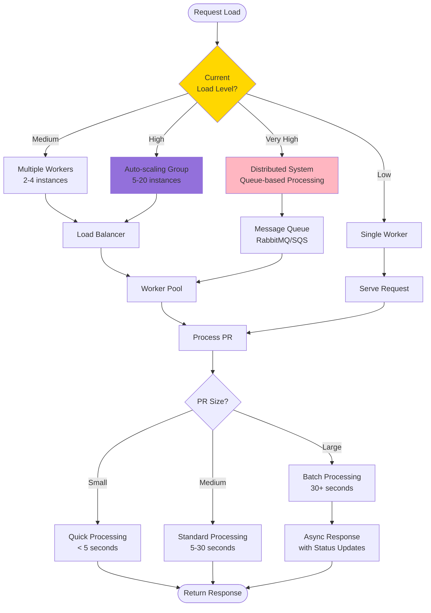
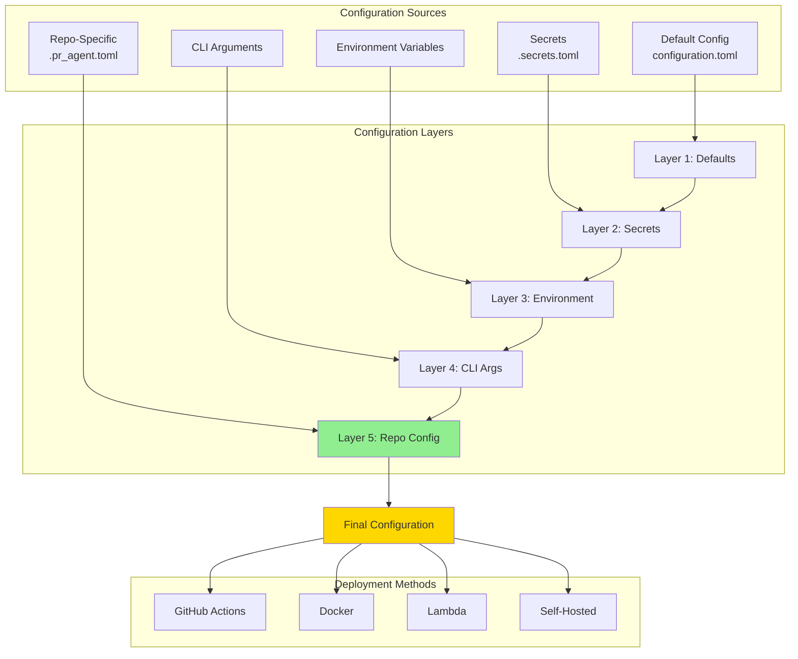
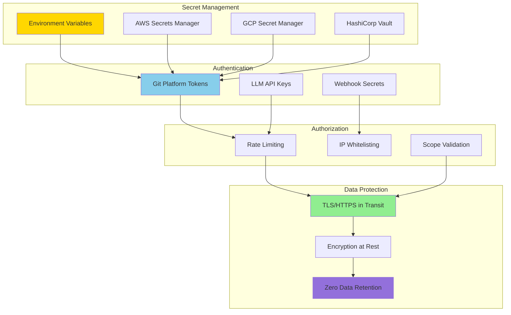

# Deployment Architecture

**Generated:** 2025-10-07

## Deployment Options Overview

## GitHub Actions Deployment

## GitHub App Deployment

## GitLab Webhook Deployment

## Docker Deployment Architecture

## AWS Lambda Deployment

```mermaid
flowchart LR
    Start([Webhook Event]) --> APIGateway[API Gateway]
    APIGateway --> Lambda[Lambda Function]

    Lambda --> ColdStart{Cold<br/>Start?}
    ColdStart -->|Yes| InitEnv[Initialize Environment:<br/>Load deps,<br/>Config,<br/>Secrets]
    ColdStart -->|No| UseWarm[Use Warm Instance]

    InitEnv --> ProcessEvent[Process Event]
    UseWarm --> ProcessEvent

    ProcessEvent --> ParsePayload[Parse Webhook Payload]
    ParsePayload --> FetchPR[Fetch PR Data]
    FetchPR --> CheckSize{PR Size<br/>OK for Lambda?}

    CheckSize -->|Yes| ProcessInline[Process in Lambda]
    CheckSize -->|No| OffloadSQS[Offload to SQS Queue]

    ProcessInline --> CallLLM[Call LLM Service]
    CallLLM --> PostResults[Post Results]
    PostResults --> Return([Return Response])

    OffloadSQS --> SQS[SQS Queue]
    SQS --> ECS[ECS Task for<br/>Large PR Processing]
    ECS --> PostResults

    style Lambda fill:#FFD700
    style ColdStart fill:#FFA500
    style OffloadSQS fill:#87CEEB
```

## Self-Hosted Server Deployment

## Scaling Considerations

## Configuration Management

## Security Architecture

