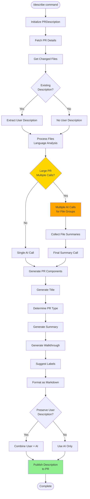
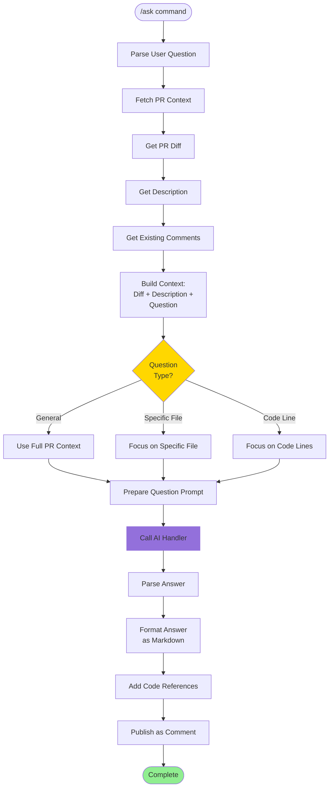
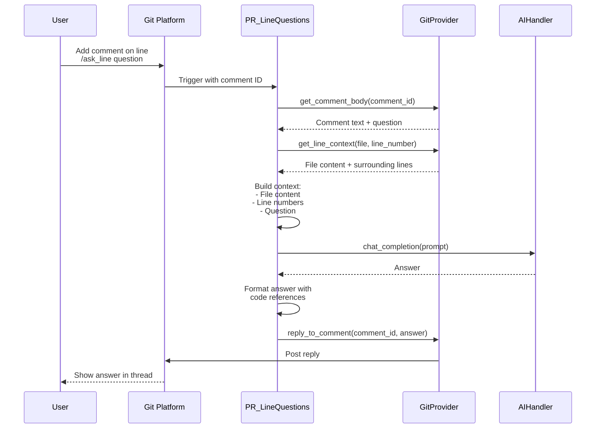
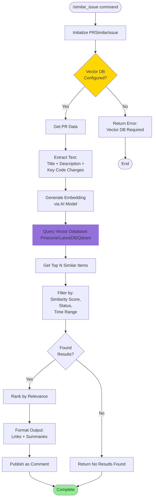
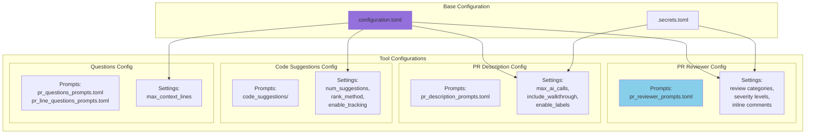

# Tools Architecture

**Generated:** 2025-10-07

## Tools Class Structure

```mermaid
classDiagram
    class BaseTool {
        <<abstract>>
        +pr_url str
        +git_provider GitProvider
        +ai_handler BaseAiHandler
        +args list
        +run() async
        +prepare_prompt() str
        +parse_response(response) dict
    }

    class PRReviewer {
        +is_auto bool
        +is_answer bool
        +run() async
        -_prepare_pr_review()
        -_get_review_data()
        -_publish_review()
        -_inline_comments()
    }

    class PRDescription {
        +run() async
        -_prepare_description()
        -_generate_title()
        -_generate_summary()
        -_generate_walkthrough()
        -_publish_description()
    }

    class PRCodeSuggestions {
        +run() async
        -_prepare_suggestions()
        -_get_code_suggestions()
        -_rank_suggestions()
        -_publish_suggestions()
        -_track_suggestions()
    }

    class PRQuestions {
        +run() async
        -_prepare_questions()
        -_get_ai_answers()
        -_publish_answers()
    }

    class PR_LineQuestions {
        +run() async
        -_get_line_context()
        -_prepare_line_question()
        -_publish_answer()
    }

    class PRUpdateChangelog {
        +run() async
        -_analyze_changes()
        -_generate_changelog()
        -_update_file()
    }

    class PRAddDocs {
        +run() async
        -_find_undocumented()
        -_generate_docs()
        -_publish_docs()
    }

    class PRGenerateLabels {
        +run() async
        -_analyze_pr()
        -_suggest_labels()
        -_publish_labels()
    }

    class PRHelpDocs {
        +run() async
        -_identify_issues()
        -_find_solutions()
        -_publish_help()
    }

    class PRSimilarIssue {
        +vector_db
        +run() async
        -_embed_pr()
        -_search_similar()
        -_rank_results()
        -_publish_results()
    }

    class PRConfig {
        +run() async
        -_get_current_config()
        -_display_config()
    }

    BaseTool <|-- PRReviewer
    BaseTool <|-- PRDescription
    BaseTool <|-- PRCodeSuggestions
    BaseTool <|-- PRQuestions
    BaseTool <|-- PR_LineQuestions
    BaseTool <|-- PRUpdateChangelog
    BaseTool <|-- PRAddDocs
    BaseTool <|-- PRGenerateLabels
    BaseTool <|-- PRHelpDocs
    BaseTool <|-- PRSimilarIssue
    BaseTool <|-- PRConfig
```

## PR Review Tool Flow

```mermaid
flowchart TB
    Start([/review command]) --> Initialize[Initialize PRReviewer]
    Initialize --> FetchPR[Fetch PR Details]

    FetchPR --> GetDiff[Get PR Diff Files]
    GetDiff --> GetDescription[Get PR Description]
    GetDescription --> GetCommits[Get Commit Messages]
    GetCommits --> GetLabels[Get Existing Labels]

    GetLabels --> ProcessDiff[Process Diff<br/>with Token Management]
    ProcessDiff --> CheckSize{Compressed<br/>or Full?}

    CheckSize -->|Full| FullContext[Use Full Context<br/>with Extra Lines]
    CheckSize -->|Compressed| CompressedContext[Use Compressed Diff<br/>Priority Files Only]

    FullContext --> BuildPrompt[Build Review Prompt]
    CompressedContext --> BuildPrompt

    BuildPrompt --> AddInstructions[Add Custom Instructions<br/>from Config]
    AddInstructions --> CallAI[Call AI Handler]

    CallAI --> ParseResponse[Parse JSON Response]
    ParseResponse --> ValidateResponse{Valid<br/>Format?}

    ValidateResponse -->|No| RetryParse[Retry Parsing<br/>or Use Defaults]
    ValidateResponse -->|Yes| FormatReview[Format Review Comment]

    RetryParse --> FormatReview
    FormatReview --> CheckInline{Publish Inline<br/>Comments?}

    CheckInline -->|Yes| CreateInline[Create Inline Comments]
    CheckInline -->|No| PublishMain[Publish Main Comment]

    CreateInline --> PublishMain
    PublishMain --> CheckLabels{Add<br/>Labels?}

    CheckLabels -->|Yes| PublishLabels[Publish Labels]
    CheckLabels -->|No| Complete([Complete])

    PublishLabels --> Complete

    style BuildPrompt fill:#9370DB
    style CallAI fill:#FFD700
    style Complete fill:#90EE90
```

## PR Description Tool Flow

## Code Suggestions Tool Flow

```mermaid
flowchart TB
    Start([/improve command]) --> Initialize[Initialize PRCodeSuggestions]
    Initialize --> FetchPR[Fetch PR Details]

    FetchPR --> GetDiff[Get Diff Files]
    GetDiff --> FilterFiles[Filter Files<br/>Ignore test/generated]

    FilterFiles --> ProcessByFile[Process Files Individually<br/>or in Groups]
    ProcessByFile --> BuildContext[Build Context for Each File]

    BuildContext --> AddMetadata[Add Metadata:<br/>Language, Patterns,<br/>Best Practices]

    AddMetadata --> CallAI[Call AI for Suggestions]
    CallAI --> ParseSuggestions[Parse Suggestions JSON]

    ParseSuggestions --> ValidateSuggestions{Valid<br/>Format?}
    ValidateSuggestions -->|No| TryFix[Try Fix JSON]
    ValidateSuggestions -->|Yes| RankSuggestions[Rank by Importance]

    TryFix --> CheckFixed{Fixed?}
    CheckFixed -->|Yes| RankSuggestions
    CheckFixed -->|No| UsePartial[Use Partial Results]

    UsePartial --> RankSuggestions
    RankSuggestions --> FilterDuplicates[Filter Duplicates]

    FilterDuplicates --> CheckFormat{Output<br/>Format?}

    CheckFormat -->|Inline| CreateInlineSuggestions[Create Inline Comments<br/>with Code Blocks]
    CheckFormat -->|Summary| CreateSummary[Create Summary Comment]

    CreateInlineSuggestions --> CheckTracking{Enable<br/>Tracking?}
    CreateSummary --> CheckTracking

    CheckTracking -->|Yes| AddTrackingIDs[Add Tracking IDs<br/>to Suggestions]
    CheckTracking -->|No| Publish[Publish Suggestions]

    AddTrackingIDs --> StoreSuggestions[Store in Database<br/>for Tracking]
    StoreSuggestions --> Publish

    Publish --> CheckChat{Enable<br/>Chat?}
    CheckChat -->|Yes| EnableReply[Enable Reply Buttons]
    CheckChat -->|No| Complete([Complete])

    EnableReply --> Complete

    style CallAI fill:#9370DB
    style RankSuggestions fill:#FFD700
    style Publish fill:#90EE90
```

## Ask Questions Tool Flow

## Line Questions Tool Flow

## Similar Issue Search Flow

## Tool Configuration

## Tool Execution Context

```mermaid
flowchart LR
    Start([Tool Execution]) --> LoadConfig[Load Configuration]
    LoadConfig --> CreateProvider[Create Git Provider]
    CreateProvider --> CreateAIHandler[Create AI Handler]

    CreateAIHandler --> SetContext[Set Execution Context:<br/>PR URL, Args,<br/>User Settings]

    SetContext --> ValidateAccess[Validate Access:<br/>Permissions,<br/>Rate Limits]

    ValidateAccess --> ExecuteTool[Execute Tool Logic]
    ExecuteTool --> CleanupResources[Cleanup Resources:<br/>Close connections,<br/>Clear cache]

    CleanupResources --> LogMetrics[Log Metrics:<br/>Duration,<br/>Tokens used,<br/>Success/Failure]

    LogMetrics --> Return([Return Result])

    style SetContext fill:#FFD700
    style ExecuteTool fill:#9370DB
    style Return fill:#90EE90
```

